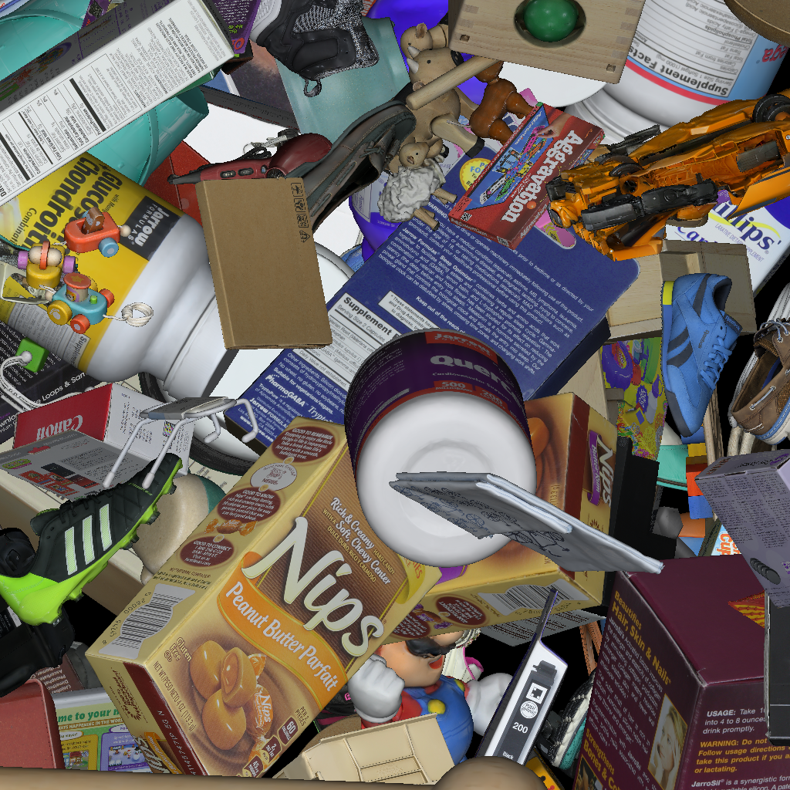
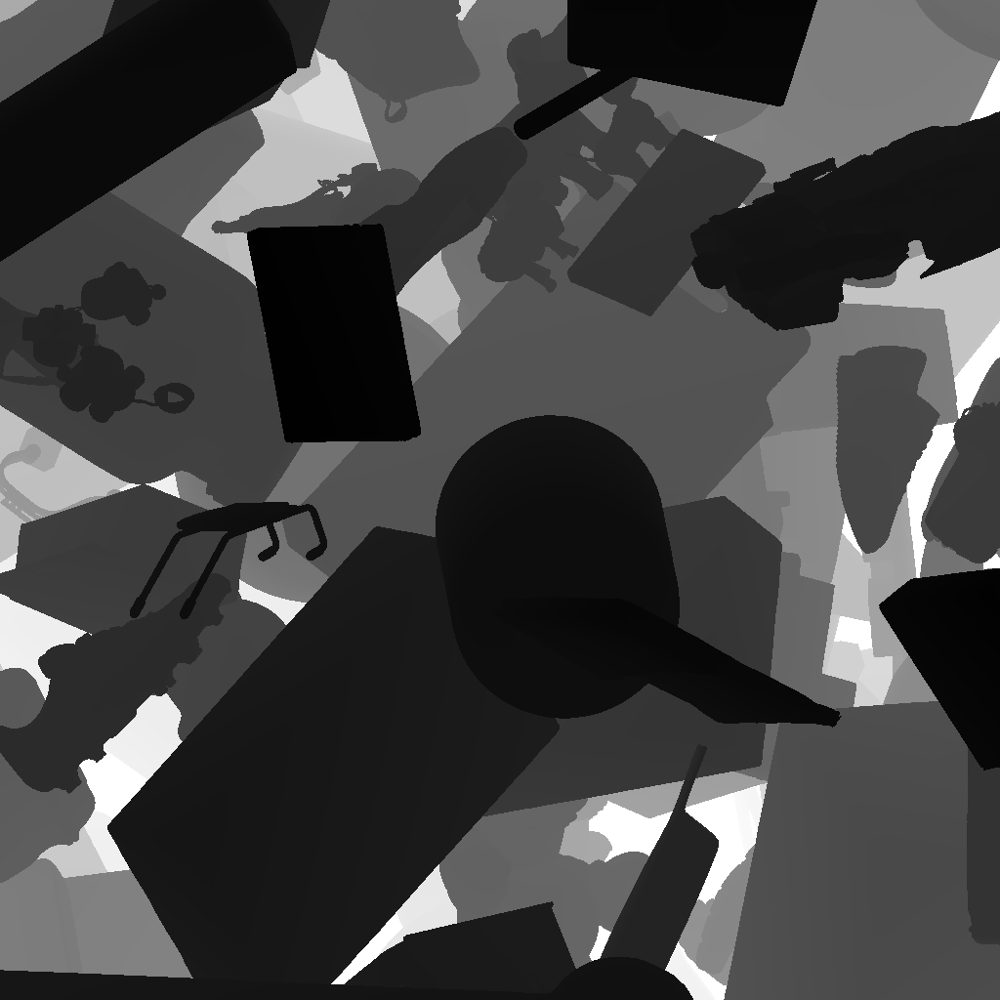
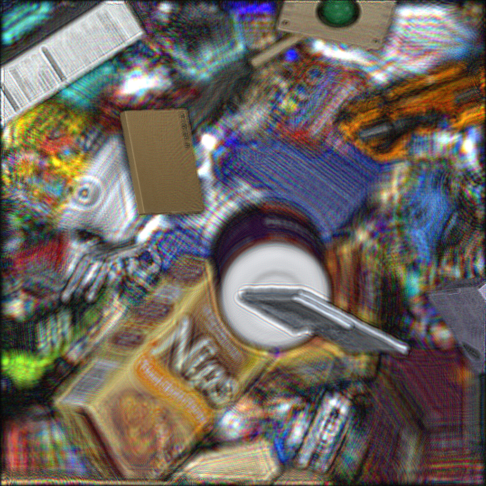
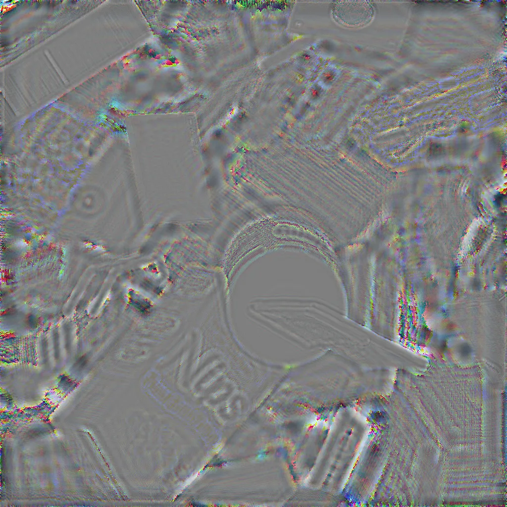

<div align="center">

<h1>KOREATECH-CGH</h1>
<h3>Large-Depth-Range Layer-Based Hologram Dataset Generation<br>for Machine Learning-Based 3D Computer-Generated Holography</h3>


**[📄 Paper](#-citation) &nbsp;·&nbsp; [🤗 Dataset](#-dataset) &nbsp;·&nbsp; [🚀 Quick Start](#-quick-start) &nbsp;·&nbsp; [🔧 Pipeline](#-pipeline)**

<br>

*A publicly available dataset of **6,000 RGBD–complex hologram pairs** for ML-based computer-generated holography (ML-CGH), plus the **official implementation** that generates it — large-scale RGB+Depth training pairs via GPU ray tracing and layer-based CGH holograms synthesized with the Angular Spectrum Method.*

Generated by [SPIN Lab (KOREATECH)](https://huggingface.co/SPIN-Lab).
· Article: [10.1016/j.optlastec.2026.115636](https://doi.org/10.1016/j.optlastec.2026.115636)
· Collection: [Hugging Face](https://huggingface.co/collections/SPIN-Lab/koreatech-cgh)

</div>

---

## 🤗 Dataset

**KOREATECH-CGH** provides 6,000 pairs (train/val/test) with aligned RGB, depth, amplitude, and phase channels, generated using a layer-based hologram method.

- **Resolutions:** 256², 512², 1024², 2048²
- **License:** **CC BY-NC 4.0** (non-commercial, attribution required)
- **Collection:** https://huggingface.co/collections/SPIN-Lab/koreatech-cgh

### Samples

| RGB | Depth |
|:---:|:---:|
|  |  |

| Amplitude | Phase |
|:---:|:---:|
|  |  |

### Hologram Configurations

| Config ID | Resolution | Pixel Pitch | Wavelengths (R,G,B) | Physical Extent (H × W × D) | Download |
|-----------|------------|-------------|---------------------|-----------------------------|----------|
| 256-3.6   | 256 × 256  | 3.6 μm      | 638/532/450 nm      | 0.9216 mm × 0.9216 mm × 10.1668 mm | [HF](https://huggingface.co/datasets/SPIN-Lab/KOREATECH-CGH-256-3.6Mu) |
| 512-3.6   | 512 × 512  | 3.6 μm      | 638/532/450 nm      | 1.8432 mm × 1.8432 mm × 20.3336 mm | [HF](https://huggingface.co/datasets/SPIN-Lab/KOREATECH-CGH-512-3.6Mu) |
| 1024-3.6  | 1024 × 1024| 3.6 μm      | 638/532/450 nm      | 3.6864 mm × 3.6864 mm × 40.6672 mm | [HF](https://huggingface.co/datasets/SPIN-Lab/KOREATECH-CGH-1024-3.6Mu) |
| 2048-3.6  | 2048 × 2048| 3.6 μm      | 638/532/450 nm      | 7.3728 mm × 7.3728 mm × 81.3344 mm | [HF](https://huggingface.co/datasets/SPIN-Lab/KOREATECH-CGH-2048-3.6Mu) |
| Coming soon | — | — | — | — | Coming soon |

#### Per-channel Specs

| Data      | Format | Channels | Precision | Scale |
|-----------|--------|----------|-----------|-------|
| RGB       | .exr   | 3        | fp32      | 0-1   |
| Depth     | .exr   | 1        | fp32      | 0-1   |
| Amplitude | .exr   | 3        | fp32      | Data dependent |
| Phase     | .exr   | 3        | fp32      | 0-1   |

#### Data Splits (total 6,000)

| Split      | Samples |
|------------|---------|
| Train      | 5,000   |
| Validation | 500     |
| Test       | 500     |

### Dataset Directory Layout

```
root
  ├─test
  │  ├─amp
  │  │  └─*.exr
  │  ├─depth
  │  ├─img
  │  └─phs
  ├─train
  │  ├─amp
  │  ├─depth
  │  ├─img
  │  └─phs
  └─validation
      ├─amp
      ├─depth
      ├─img
      └─phs
```

### Source 3D Models

RGB-D scenes are rendered from 3D meshes in the [Scanned Objects by Google Research](https://research.google/blog/scanned-objects-by-google-research-a-dataset-of-3d-scanned-common-household-items/) dataset.

---

## 🔧 Pipeline

The code in this repository reproduces the full dataset generation pipeline:

```
  3D Object Assets (OBJ + textures)
           │
           ▼
  ┌─────────────────────┐
  │    RGBD_generator   │   C++ · CUDA · OptiX 
  │   (ray tracing)     │   orthographic rendering
  └──────────┬──────────┘
             │  RGB images  (.exr / .png)
             │  Depth maps  (.exr / .png)
             │  Scene CSVs  (optional)
             ▼
  ┌─────────────────────┐
  │  Hologram_generator │   Python · CuPy
  │  (hologram gen)     │   AP-LBM · SM-LBM · ADV-LBM
  └──────────┬──────────┘
             │  Complex holograms (.npy)
             │  dtype: complex64 · shape: (3, H, W)
             ▼
  ┌─────────────────────┐
  │       dpm.py        │   Double-Phase Method
  │   (SLM encoding)    │   off-axis carrier + DPM interleaving
  └──────────┬──────────┘
             │  Phase-only PNG  (8-bit · [0, 2π])
             ▼
        SLM / Display
```

---

## 📁 Repository Structure

```
KOREATECH-CGH/
├── RGBD_generator/              # C++/CUDA ray-tracing renderer
│   ├── RUCGH/                   # OptiX 7 source (kernels, ray handler)
│   ├── CMakeLists.txt
│   └── README.md
├── Hologram_generator/          # Python hologram synthesis
│   ├── generate_hologram.py     # RGB+D → complex hologram (.npy)
│   ├── dpm.py                   # complex hologram → SLM phase image (.png)
│   ├── npy_convert.py           # dataset utilities: RGB resize, depth rescale, amp/phase export
│   ├── requirements.txt
│   └── README.md
└── csv/                         # Example scene description files
```

---

## 🛠️ Installation

### RGBD_generator

| Dependency | Version |
|:---|:---|
| NVIDIA GPU with OptiX-capable driver | — |
| CUDA Toolkit | 12.x |
| NVIDIA OptiX SDK | **8.0.0** |
| OpenCV | any recent |
| CMake | ≥ 3.25.2 |
| C++ compiler | C++20 |

> **Note:** OptiX must be downloaded manually from the [NVIDIA Developer site](https://developer.nvidia.com/designworks/optix/downloads).

**Linux:**
```bash
cd RGBD_generator
export OPTIX_INSTALL_DIR=/opt/optix      # root of the extracted OptiX SDK
cmake -S . -B build
cmake --build build -j
```

**Windows** *(x64 Native Tools Command Prompt or Developer PowerShell):*
```powershell
cd RGBD_generator
cmake -S . -B build -DOPTIX_INSTALL_DIR="C:/ProgramData/NVIDIA Corporation/OptiX SDK 8.0.0"
cmake --build build --config Release
```

The built executable is:
- Linux → `build/RUCGH/RUCGH_exe`
- Windows → `build/RUCGH/Release/RUCGH_exe.exe`

The PTX shader needed at runtime is emitted to `build/RUCGH/CMakeFiles/myptx.dir/`. Pass this directory as `--ptx_path`.

---

### Hologram_generator

| Dependency | Version |
|:---|:---|
| Python | ≥ 3.10 |
| NVIDIA GPU | — |
| CUDA Toolkit | 11.x or 12.x |
| CuPy | matching CUDA version |

```bash
cd Hologram_generator

# 1. Install CuPy — choose the wheel matching your CUDA version
pip install cupy-cuda12x   # CUDA 12.x
pip install cupy-cuda11x   # CUDA 11.x

# 2. Install remaining dependencies
pip install -r requirements.txt

# 3. Verify GPU visibility
python -c "import cupy; cupy.show_config()"
```

---

## 🚀 Quick Start

Full end-to-end example: render 100 scenes, synthesize holograms, encode for SLM.

### Step 1 — Render RGB+D scenes

```bash
./RGBD_generator/build/RUCGH/RUCGH_exe gen \
    --width 1024 --height 1024 \
    --wavelength 638e-9 532e-9 450e-9 \
    --pixel_pitch 3.6e-6 \
    --object_mindepth 0.00 --object_maxdepth 0.05 \
    --obj_path ./data/objects \
    --rgb_output_path ./out/rgb \
    --depth_output_path ./out/depth \
    --csv_path ./out/csv \
    --ptx_path ./RGBD_generator/build/RUCGH/CMakeFiles/myptx.dir \
    --begin_index 0 --end_index 100 \
    --num_objects 4 \
    --device 0 --num_devices 1 \
    --rgbd_only
```

### Step 2 — Synthesize holograms

```bash
cd Hologram_generator

python generate_hologram.py \
    --input  ../out/rgb \
    --depth  ../out/depth \
    --output ../out/holograms \
    --gen_method edge-padded-AP-LBM --uniform_phase \
    --width 1024 --height 1024 --pp 3.6e-6 \
    --min_z 0.00 --max_z 0.05 --depth_level 256
```

### Step 3 — Encode for SLM *(optional)*

```bash
python dpm.py \
    --input  ../out/holograms \
    --output ../out/dpm \
    --encoding Maimonev \
    --off_axis_x -1.1 --move_z -0.04
```

---

## 🎬 RGBD Generator

RUCGH renders textured 3D objects with an orthographic view that matches the plane waves of CGH, producing float32 RGB images and per-pixel depth maps.

> **Dataset resolution note:** We render all scenes at **4096 × 4096** and resize them to each target resolution (256, 512, 1024, 2048) for the corresponding hologram generation.

### 3D Object Dataset

The scenes in our paper were rendered using the **Scanned Objects by Google Research**

> 🔗 **[Scanned Objects by Google Research](https://app.gazebosim.org/GoogleResearch/fuel/collections/Scanned%20Objects%20by%20Google%20Research)**

Each object in the collection is already structured with `meshes/` and `materials/textures/` folders, matching the input format expected by RUCGH (see below).

### Input directory format

`--obj_path` must contain one subdirectory per object. Each subdirectory requires a `meshes/` folder with an `.obj` file. Textures are resolved from `materials/textures/texture.png`, falling back to any PNG/JPG in that directory.

```
obj_path/
  chair_01/
    meshes/
      model.obj
    materials/
      textures/
        texture.png
  lamp_03/
    meshes/
      model.obj
    materials/
      textures/
        lamp.jpg
```

### Output files

For each index `i` in `[begin_index, end_index)`:

| File | Format | Description |
|:---|:---:|:---|
| `rgb_output_path/i.exr` | float32 | RGB image **output** |
| `rgb_output_path/i.png` | uint8 | RGB **preview** |
| `depth_output_path/i.exr` | float32 | Depth map in meters — **output** |
| `depth_output_path/i.png` | uint8 | Normalized depth preview |
| `csv_path/i.csv` | CSV | Scene description (object names, transforms) |

### More examples

<details>
<summary><b>Generate 6 000 scenes (paper dataset)</b></summary>

```bash
./RGBD_generator/build/RUCGH/RUCGH_exe gen \
    --width 1024 --height 1024 \
    --wavelength 638e-9 532e-9 450e-9 \
    --pixel_pitch 3.6e-6 \
    --object_mindepth 0.0 --object_maxdepth 0.04066723 \
    --obj_path ./data/objects \
    --rgb_output_path ./out/rgb \
    --depth_output_path ./out/depth \
    --csv_path ./out/csv \
    --ptx_path ./RGBD_generator/build/RUCGH/CMakeFiles/myptx.dir \
    --begin_index 0 --end_index 6000 \
    --num_objects 100 \
    --device 0 --num_devices 1 \
    --rgbd_only
```
</details>

<details>
<summary><b>Replay existing scenes from CSV (reproducibility)</b></summary>

```bash
./RGBD_generator/build/RUCGH/RUCGH_exe gen \
    --width 1024 --height 1024 \
    --wavelength 638e-9 532e-9 450e-9 \
    --pixel_pitch 3.6e-6 \
    --object_mindepth 0.0 --object_maxdepth 0.04066723 \
    --obj_path ./data/objects \
    --rgb_output_path ./out/rgb \
    --depth_output_path ./out/depth \
    --csv_path ./out/csv \
    --ptx_path ./RGBD_generator/build/RUCGH/CMakeFiles/myptx.dir \
    --begin_index 0 --end_index 100 \
    --num_objects 100 --device 0 --num_devices 1 \
    --load_csv --rgbd_only
```
</details>

<details>
<summary><b>Full CLI reference</b></summary>

```
Geometry
  --width              output width in pixels
  --height             output height in pixels
  --wavelength R G B   wavelengths [m]   (e.g. 638e-9 532e-9 450e-9)
  --pixel_pitch        pixel pitch [m]

Scene
  --object_mindepth    nearest object distance [m]
  --object_maxdepth    farthest object distance [m]
  --num_objects        objects sampled per scene

Paths
  --obj_path           directory of object subfolders
  --floor_path         directory of floor textures  (optional)
  --rgb_output_path    RGB render output directory
  --depth_output_path  depth render output directory
  --csv_path           scene-description CSV directory
  --ptx_path           directory containing the orthographic PTX shader

Indexing
  --begin_index        first scene index (inclusive)
  --end_index          last scene index (exclusive)
  --load_csv           replay scenes from <csv_path>/i.csv
  --rgbd_only          required flag in this release

Hardware
  --device             CUDA device id
  --num_devices        number of GPUs to use
  --precision          accepted for compatibility; fp32 is always used
```
</details>

---

## 💡 Hologram Generator

Converts RGB+D pairs to complex-amplitude holograms via the **Angular Spectrum Method** with layer-based depth decomposition.

### Methods

| Flag | Type | Description |
|:---|:---:|:---|
| `edge-padded-AP-LBM` | Proposed | AP-LBM with edge padding — recommended |
| `AP-LBM` |  Proposed | AP-LBM with zero (constant) padding |
| `SM-LBM` | Baseline | Standard masked layer-based method |
| `ADV-LBM` | Baseline | Amplitude-compensated bidirectional masking |

### Input format

| Type | Accepted formats | Notes |
|:---|:---|:---|
| RGB image | `.png` `.jpg` `.webp` `.exr` | — |
| Depth map | `.png` `.jpg` `.webp` `.exr` | Single-channel; first channel used if multi-channel |

- **PNG / JPG depths**: `255` = closest, `0` = farthest
- **EXR depths**: float in meters (smaller = closer); add `--auto_depth` to derive `min_z`/`max_z` from the file

When a directory is given, pairs are matched by **filename stem** (`rgb/0.png` ↔ `depth/0.png`).

### Output format

One `.npy` file per input pair — `complex64`, shape `(3, H, W)` ordered R, G, B.

```python
import numpy as np

holo  = np.load('./holograms/scene01.npy')  # complex64, (3, H, W)
amp   = np.abs(holo)
phase = np.angle(holo)
```

### Examples

<details open>
<summary><b>Single image</b></summary>

```bash
python generate_hologram.py \
    --input img.png --depth depth.png \
    --output ./holograms \
    --gen_method edge-padded-AP-LBM --uniform_phase \
    --width 1024 --height 1024 --pp 3.6e-6 \
    --min_z 0.01 --max_z 0.05 --depth_level 256
```
</details>

<details>
<summary><b>Batch (directory of pairs)</b></summary>

```bash
python generate_hologram.py \
    --input ./rgb   --depth ./depth \
    --output ./holograms \
    --gen_method edge-padded-AP-LBM --uniform_phase \
    --width 1920 --height 1080 --pp 3.6e-6 \
    --min_z 0.0 --max_z 0.0226912 --depth_level 256
```
</details>

<details>
<summary><b>Compare all four methods on the same scene</b></summary>

```bash
for m in edge-padded-AP-LBM AP-LBM SM-LBM ADV-LBM; do
    python generate_hologram.py \
        --input img.png --depth depth.png \
        --output ./holograms_$m \
        --gen_method $m --uniform_phase \
        --width 1024 --height 1024 --pp 3.6e-6 \
        --min_z 0.01 --max_z 0.05 --depth_level 256
done
```
</details>

<details>
<summary><b>Full CLI reference</b></summary>

```
I/O
  --input          input image file or directory
  --depth          depth file or directory
  --output         output directory for .npy holograms  (default: ./holograms)
  --gen_method     {edge-padded-AP-LBM, AP-LBM, SM-LBM, ADV-LBM}

Optics
  --width          hologram width in pixels    (default: 1024)
  --height         hologram height in pixels   (default: 1024)
  --pp             pixel pitch [m]             (default: 3.6e-6)
  --wavelength R G B                           (default: 638e-9 532e-9 450e-9)

Depth
  --min_z          nearest object distance [m]    (default: 0.01)
  --max_z          farthest object distance [m]   (default: 0.05)
  --post_z         extra propagation after generation [m]  (default: 0)
  --depth_level    number of depth layers          (default: 256)
  --auto_depth     (EXR only) derive min_z/max_z from depth values

Image
  --gamma          gamma applied to RGB input    (default: 1.0)

Phase initialization (choose one)
  --random_phase   random initial phase
  --no_phase_init  no initial phase
  --uniform_phase  uniform phase per layer  (recommended for AP-LBM)

Hardware
  --gpu_id         CUDA device id  (default: 0)
```
</details>

---

## 🖥️ DPM Encoding

`dpm.py` converts a complex hologram to a **phase-only 8-bit PNG** for SLM display. It applies a per-channel off-axis carrier so R, G, B reconstructions separate in the Fourier plane, then encodes residual amplitude using the Double-Phase Method.

### Encoding modes

| Mode | Pattern | Description |
|:---|:---:|:---|
| `Maimonev` | Row-interleaved | Alternate CW / CCW phase row by row |
| `Maimoneh` | Column-interleaved | Alternate column by column |
| `Anti-aliasing` | Checkerboard | 2×2 CW / CCW interleave |
| `phase` | — | Phase only — drop amplitude (no DPM) |

Output pixel value `0–255` maps linearly to phase `[0, max_pi × π]` (default `[0, 2π]`).

### Examples

<details open>
<summary><b>Single hologram</b></summary>

```bash
python dpm.py \
    --input  ./holograms/scene01.npy \
    --output ./dpm/scene01.png \
    --encoding Maimonev \
    --off_axis_x -1.1 --move_z -0.04
```
</details>

<details>
<summary><b>Whole directory</b></summary>

```bash
python dpm.py \
    --input  ./holograms \
    --output ./dpm \
    --encoding Maimonev \
    --off_axis_x -1.1 --move_z -0.04
```
</details>

<details>
<summary><b>Full CLI reference</b></summary>

```
I/O
  --input          input .npy hologram file or directory
  --output         output PNG file or directory

Encoding
  --encoding       {Maimonev, Maimoneh, Anti-aliasing, phase}
  --off_axis_x     off-axis carrier angle, x [deg]   (default: 0)
  --off_axis_y     off-axis carrier angle, y [deg]   (default: 0)
  --move_z         ASM propagation [m] before encoding  (default: 0)

Optics
  --pp             pixel pitch [m]               (default: 3.6e-6)
  --wavelength R G B                             (default: 638e-9 532e-9 450e-9)

Output
  --max_pi         output phase range in units of π  (default: 2 → [0, 2π])
  --gaussian       sigma for phase smoothing  (default: 1 = off)
  --gamma          gamma before 8-bit quantization   (default: 1.0)

Hardware
  --gpu_id         CUDA device id  (default: 0)
```
</details>

---

## 🔄 Dataset Utilities (`npy_convert.py`)

`npy_convert.py` provides three batch-parallel conversion utilities used to prepare the dataset at each resolution.

| Command | Input | Output | Purpose |
|:---|:---|:---|:---|
| `rgb` | float32 RGB `.exr` | resized float32 RGB `.exr` + PNG preview | Downscale 4096 renders to 256 / 512 / 1024 / 2048 |
| `depth` | float32 depth `.exr` | resized float32 depth `.exr` + PNG preview | Downscale depth maps (metric values preserved) |
| `complex` | complex64 `.npy` `(3, H, W)` | amplitude `.exr` + phase `.exr` | Extract amplitude and phase from holograms |

### Examples

**Resize 4096 × 4096 RGB renders to 1024 × 1024:**
```bash
python npy_convert.py rgb \
    --input  ./out/rgb \
    --output ./out/rgb_1024 \
    --size 1024 1024 \
    --preview ./out/rgb_1024_preview
```

**Resize depth maps to match:**
```bash
python npy_convert.py depth \
    --input  ./out/depth \
    --output ./out/depth_1024 \
    --size 1024 1024 \
    --preview ./out/depth_1024_preview
```

**Extract amplitude and phase from holograms:**
```bash
python npy_convert.py complex \
    --input ./out/holograms \
    --amp   ./out/amp \
    --phase ./out/phase
```

<details>
<summary><b>Full CLI reference</b></summary>

```
Global
  --workers N   number of threads for batch mode  (default: CPU core count)

rgb
  --input       input EXR file or directory
  --output      output EXR file or directory  (default: overwrite input)
  --size W H    target resolution, e.g. --size 1024 1024
  --preview     directory for 8-bit PNG previews

depth
  --input       input EXR file or directory
  --output      output EXR file or directory
  --size W H    target resolution, e.g. --size 1024 1024
  --preview     directory for normalised PNG previews

complex
  --input       input .npy file or directory
  --amp         amplitude output EXR file or directory
  --phase       phase output EXR file or directory  (phase mapped to [0, 1])
```
</details>

---

## 💬 Questions & Support

For any questions or discussion, please use the [GitHub Discussions](../../discussions) forum. For bug reports, please open a [GitHub Issue](../../issues).

---

## 📜 License

This repository contains two separately licensed components:

- **Dataset** — the KOREATECH-CGH data (RGB, depth, amplitude, phase) hosted on Hugging Face is licensed under the **Creative Commons Attribution-NonCommercial 4.0 International (CC BY-NC 4.0)** license. You may use, adapt, and share the data for non-commercial purposes with proper attribution. Commercial use is prohibited. See the [official CC BY-NC 4.0 terms](https://creativecommons.org/licenses/by-nc/4.0/).
- **Code** — the source in this repository is licensed under the **Apache License, Version 2.0**. See the acknowledgements below and the file headers for details.

---

## 📝 Citation

If you use this dataset or code, please cite:

```bibtex
@article{LEE2026115636,
title = {A large-depth-range layer-based hologram dataset generation for machine learning-based 3D computer-generated holography},
journal = {Optics & Laser Technology},
volume = {203},
pages = {115636},
year = {2026},
issn = {0030-3992},
doi = {https://doi.org/10.1016/j.optlastec.2026.115636},
url = {https://www.sciencedirect.com/science/article/pii/S0030399226009874},
author = {Jaehong Lee and You Chan No and YoungWoo Kim and Duksu Kim},
keywords = {CGH(Computer-generated holography), Hologram, Machine-learning, Dataset, RGB-d, ML-CGH},
abstract = {Machine learning-based computer-generated holography (ML-CGH) has advanced rapidly in recent years, yet progress is constrained by the limited availability of high-quality, large-scale hologram datasets. To address this, we present KOREATECH-CGH, a publicly available dataset comprising 6000 pairs of RGB-D images and complex holograms across resolutions ranging from 256×256 to 2048×2048, with depth ranges extending to the theoretical limits of the angular spectrum method for wide 3D scene coverage. To improve hologram quality at large depth ranges, we introduce amplitude projection, a post-processing technique that replaces amplitude components of hologram wavefields at each depth layer while preserving phase. This approach enhances reconstruction fidelity, achieving 27.46 dB PSNR and 0.87 SSIM, surpassing a recent optimized silhouette-masking layer-based method by 3.86 dB and 0.09 SSIM, respectively. We further validate the utility of KOREATECH-CGH through experiments on hologram generation and super-resolution using state-of-the-art ML models, confirming its applicability for training and evaluating next-generation ML-CGH systems.}
}
```

---

## 🙏 Acknowledgements

`RGBD_generator` includes code adapted from [Ingo Wald's OptiX 7 course](https://github.com/ingowald/optix7course). The upstream course code and the vendored `gdt` math library are copyright Ingo Wald and licensed under the **Apache License 2.0**, as noted in the original source headers.

This project is supported by the National Research Foundation of Korea (NRF) through the Ministry of Education's Basic Science Research Program (Grant 2021R1I1A3048263, 50%) and by the Institute of Information and Communications Technology Planning and Evaluation (IITP) grant funded by the Korea Government (MSIT) (Grant 2019-0-00001, 50%).

Copyright 2026 SPIN Lab (Korea University of Technology and Education) and Digital Holography Research Group (Electronics and Telecommunications Research Institute)

Licensed under the Apache License, Version 2.0 (the "License");
you may not use this file except in compliance with the License.
You may obtain a copy of the License at
http://www.apache.org/licenses/LICENSE-2.0

Unless required by applicable law or agreed to in writing, software
distributed under the License is distributed on an "AS IS" BASIS,
WITHOUT WARRANTIES OR CONDITIONS OF ANY KIND, either express or implied.
See the License for the specific language governing permissions and
limitations under the License.
